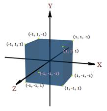
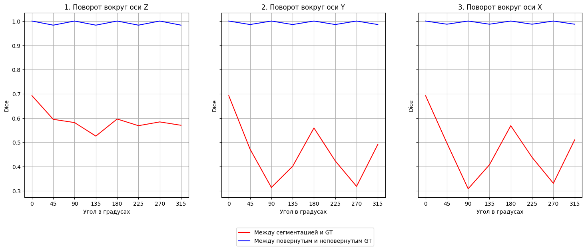
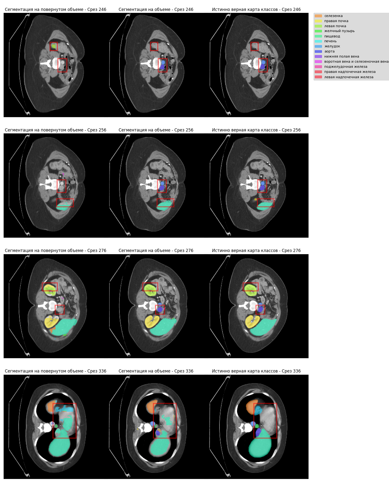

# Эксперимент по оценке влияния угла поворота 3D КТ снимка на итоговоый результат сегментации

## Введение

В данном эксперименте рассматривается гипотеза о том, что модели машинного обучения, используемые для сегментации медицинских изображений, могут переобучаться под конкретное положение объекта в пространстве. Это означает, что модели могут демонстрировать высокую точность сегментации на данных с фиксированной ориентацией объекта, но значительно терять в качестве при изменении его положения.

Для оценки влияния положения объекта в пространстве на итоговый результат сегментации была использована предобученная модель Unetr с оригинальной обработкой данных из статьи. Датасет для обучения состоит из снимков КТ, зафиксированных в пространстве, то есть с одной и той же ориентацией. На вход модели подаются фрагменты изображения размером $96 \times 96 \times 96$ вокселей. В ходе обучения к подаваемым на вход объёмам случайным образом могли быть применены следующие искажения:
- зеркальное отражение по одной из осей,
- поворот по одной из осей на $90$ градусов,
- добавление шума.

КТ снимки были сняты таким образом, что две оси имеют одинаковое разрешение, а третья ось имеет разрешение отличающееся от него. Авторы учли это при обработке данных и применяют пересчёт разрешения по каждой из осей для получения объёма с примерно равным разрешением по всем осям. Для моделирования другого положения объекта в пространстве применялись повороты по каждой из осей. Однако, чтобы моделировать ситуацию, при которой объект был снят в другом положении, необходимо выполнять поворот объёма после пересчёта разрешения, чтобы не потерять качество снимка. Таким образом, операция поворота объёма производилась сразу после пересчёта разрешения в оригинальной обработке данных. Также для избежания потери части снимка при повороте каждый объём дополнялся рамками до размера $481 \times 481 \times 481$.

Как уже было сказано, моделирование различных положений объекта в пространстве будет производиться поворотом исходного снимка по одной из трех стандартных осей X, Y, Z, которые расположены как на картинке ниже.

Стоит отметить, что поворот на угол, не кратный 90 градусам, приводит к потере информации как на снимке, так и на карте классов, а добавление рамки ухудшает качество сегментации. Для того чтобы понять, насколько велика потеря информации при повороте объёмов, были проведены замеры ошибки MAE для снимка и метрики Dice для карты классов путём применения поворота к объектам и обратного поворота, возвращающего объёмы в исходное положение, с последующим сравнением полученных объёмов с оригинальными, к которым не были применены никакие повороты. В ходе обработки данных снимок нормируется в диапазон $[0, 1]$, где 0 означает минимальную интенсивность. Так как снимок не полностью состоит из ненулевых значений, MAE считалась только между ненулевыми вокселями.

## Результаты

Далее будут описаны результаты экспериментов. Для оценки результатов в таблицах и графиках используются следующие понятия:
- Dice между сегментацией и GT — метрика Dice, подсчитанная между сегментацией, предсказанной моделью на повернутом снимке, и повернутой истинной (Ground truth, GT) картой классов.
- Dice между повернутым и неповернутым GT — метрика Dice, подсчитанная между повернутой GT картой классов, к которой применили обратный поворот, и нетронутой GT картой классов.
- MAE между повернутым и неповернутым снимком — ошибка MAE, подсчитанная между снимком, к которому применили поворот и обратный поворот, и нетронутым снимком; считается только между ненулевыми вокселями из оригинального и повернутого объемов.

Разница между сегментацией снимков с и без рамок показана в таблице ниже.
|  | Dice между сегментацией и GT |
| --- | --- |
| На снимках с рамкой | 0.692 |
| На снимках без рамки | 0.774 |

Ниже представлены графики и таблица с результатами экспериментов. Были визуализированы значения “Dice между сегментацией и GT” для оценки влияния положения объекта на качество сегментации и “Dice между повернутым и неповернутым GT” для понимания, насколько поворот влияет на потерю информации с карты классов.

| Ось | Угол поворота | Dice между сегментацией и GT | Dice между повернутым и неповернутым GT | MAE между повернутым и неповернутым снимком |
| --- | --- | --- | --- | --- |
| - | 0 | 0.692 | 1.0 | 0.0 |
| Z | 45 | 0.595 | 0.983 | 0.009 |
| Z | 90 | 0.581 | 1.000 | 0.000 |
| Z | 135 | 0.526 | 0.983 | 0.009 |
| Z | 180 | 0.596 | 1.000 | 0.000 |
| Z | 225 | 0.568 | 0.983 | 0.009 |
| Z | 270 | 0.584 | 1.000 | 0.000 |
| Z | 315 | 0.570 | 0.983 | 0.009 |
| Y | 45 | 0.472 | 0.986 | 0.005 |
| Y | 90 | 0.314 | 1.000 | 0.000 |
| Y | 135 | 0.401 | 0.986 | 0.005 |
| Y | 180 | 0.559 | 1.000 | 0.000 |
| Y | 225 | 0.423 | 0.986 | 0.005 |
| Y | 270 | 0.318 | 1.000 | 0.000 |
| Y | 315 | 0.492 | 0.986 | 0.005 |
| X | 45 | 0.497 | 0.987 | 0.007 |
| X | 90 | 0.308 | 1.000 | 0.000 |
| X | 135 | 0.407 | 0.987 | 0.007 |
| X | 180 | 0.568 | 1.000 | 0.000 |
| X | 225 | 0.438 | 0.987 | 0.007 |
| X | 270 | 0.331 | 1.000 | 0.000 |
| X | 315 | 0.510 | 0.987 | 0.007 |

Также были сохранены изображения для визуального осмотра предсказаний модели, содержащие срезы, на которых минимальный Dice между сегментацией на повернутом и неповернутом изображении, с выделением "ошибочных" участков. На изображении ниже показаны срезы 3D объёма по одной из осей с наложенными картами классов для эксперимента с поворотом объема на 135 градусов по оси Y. Первый столбец показывает сегментацию модели на повернутом изображении, второй столбец показывает сегментацию модели на неповернутом изображении, третий столбец показывает оригинальную GT карту классов.

## Особенности реализации
Важно отметить, что опубликованные авторами веса отличаются от тех, что были использованы в статье. Это связано с тем, что при написании статьи авторы использовали дополнительный [закрытый датасет](https://github.com/Project-MONAI/research-contributions/issues/69#issuecomment-1168755045), а опубликованные веса соответствуют модели, обученной исключительно на данных BTCV. 

## Сравнение результатов при разных способах интерполяции

Поскольку поворот на угол некратный 90 градусов невозможно осуществить однозначно, применяются методы интерполяции, которых достаточно много. Далее будет показаны значения Dice между сегментацией и GT, Dice между повернутым и неповернутым GT и MAE между повернутым и неповернутым снимком для разных способ интерполяции при повороте изображения и карты классов. При подсчете значений метрик в таблице выше использовись интерполяция **bilinear** для поворота изображений и самописная интерполяция **detailed** для поворота карт классов.

В таблицах представлены различные методы интерполяции, применяемые как к изображению, так и к карте классов при повороте на заданный угол.

- Если в колонке указана интерполяция для изображения, то используется именно она. Если интерполяция не указана, по умолчанию применяется **bilinear** из библиотеки **MONAI**.
  
- Если в колонке указана интерполяция карты классов, то используется она. Если интерполяция карты классов не указана, по умолчанию применяется **nearest** из библиотеки **Torchio**.

**Используемые библиотеки и методы интерполяции:**

- Из библиотеки **Torchio** для поворота изображений использовались методы интерполяции: **linear**, **blackman**, **bspline**, **cosine**, **gaussian**, **hamming**, **lanczos**, **welch**.
  
- Из библиотеки **MONAI** для поворота изображений использовались: **bilinear**, **nearest**.

- Для карты классов из библиотеки **Torchio** применялись интерполяции: **nearest**, **label_gaussian**.

- Для карты классов также использовался собственный метод интерполяции, обозначаемый как **detailed**.

**Обратный поворот:**

- Для интерполяций из библиотек **Torchio** и **MONAI** обратный поворот выполнялся с помощью вызова метода `.inverse` у объектов, применяющих поворот.
  
- Обратный поворот для самописной интерполяции **detailed** выполнялся путем применения объекта, выполняющего поворот на противоположный угол.

### Dice между сегментацией и GT
| Ось | Угол поворота | Интерполяция по умолчанию | Интепроляция изображения nearest | Интепроляция изображения linear | Интепроляция изображения blackman | Интепроляция изображения bspline | Интепроляция изображения cosine | Интепроляция изображения gaussian | Интепроляция изображения hamming | Интепроляция изображения lanczos | Интепроляция изображения welch | Интерполяция карты классов label gaussian | Интерполяция карты классов detailed |
| --- | --- | --- | --- | --- | --- | --- | --- | --- | --- | --- | --- | --- | --- |
| Z | 45 | 0.588 | 0.590 | 0.588 | 0.579 | 0.591 | 0.585 | 0.573 | 0.591 | 0.585 | 0.580 | 0.608 | 0.595 |
| Z | 90 | 0.581 | 0.581 | 0.581 | 0.581 | 0.581 | 0.581 | 0.562 | 0.581 | 0.581 | 0.581 | 0.590 | 0.581 |
| Z | 135 | 0.522 | 0.521 | 0.522 | 0.516 | 0.524 | 0.519 | 0.505 | 0.524 | 0.519 | 0.516 | 0.536 | 0.526 |
| Z | 180 | 0.596 | 0.596 | 0.596 | 0.596 | 0.596 | 0.596 | 0.580 | 0.596 | 0.596 | 0.596 | 0.604 | 0.596 |
| Z | 225 | 0.563 | 0.563 | 0.563 | 0.552 | 0.564 | 0.557 | 0.549 | 0.564 | 0.557 | 0.552 | 0.581 | 0.568 |
| Z | 270 | 0.584 | 0.584 | 0.584 | 0.584 | 0.584 | 0.584 | 0.566 | 0.584 | 0.584 | 0.584 | 0.591 | 0.584 |
| Z | 315 | 0.566 | 0.564 | 0.566 | 0.558 | 0.568 | 0.562 | 0.551 | 0.568 | 0.562 | 0.558 | 0.583 | 0.570 |
| Y | 45 | 0.469 | 0.466 | 0.469 | 0.467 | 0.468 | 0.467 | 0.462 | 0.468 | 0.466 | 0.467 | 0.480 | 0.472 |
| Y | 90 | 0.314 | 0.314 | 0.314 | 0.314 | 0.314 | 0.314 | 0.313 | 0.314 | 0.314 | 0.314 | 0.316 | 0.314 |
| Y | 135 | 0.399 | 0.398 | 0.399 | 0.400 | 0.401 | 0.399 | 0.389 | 0.401 | 0.398 | 0.399 | 0.408 | 0.401 |
| Y | 180 | 0.559 | 0.559 | 0.559 | 0.559 | 0.559 | 0.559 | 0.548 | 0.559 | 0.559 | 0.559 | 0.566 | 0.559 |
| Y | 225 | 0.420 | 0.419 | 0.420 | 0.421 | 0.422 | 0.420 | 0.413 | 0.422 | 0.420 | 0.421 | 0.430 | 0.423 |
| Y | 270 | 0.318 | 0.318 | 0.318 | 0.318 | 0.318 | 0.318 | 0.315 | 0.318 | 0.318 | 0.318 | 0.320 | 0.318 |
| Y | 315 | 0.489 | 0.488 | 0.489 | 0.488 | 0.490 | 0.487 | 0.480 | 0.490 | 0.486 | 0.488 | 0.501 | 0.492 |
| X | 45 | 0.496 | 0.496 | 0.496 | 0.495 | 0.496 | 0.495 | 0.485 | 0.496 | 0.495 | 0.496 | 0.504 | 0.497 |
| X | 90 | 0.308 | 0.308 | 0.308 | 0.308 | 0.308 | 0.308 | 0.313 | 0.308 | 0.308 | 0.308 | 0.311 | 0.308 |
| X | 135 | 0.406 | 0.407 | 0.406 | 0.406 | 0.407 | 0.406 | 0.398 | 0.406 | 0.406 | 0.406 | 0.413 | 0.407 |
| X | 180 | 0.568 | 0.568 | 0.568 | 0.568 | 0.568 | 0.568 | 0.554 | 0.568 | 0.568 | 0.568 | 0.575 | 0.568 |
| X | 225 | 0.437 | 0.436 | 0.437 | 0.437 | 0.437 | 0.437 | 0.432 | 0.437 | 0.436 | 0.437 | 0.443 | 0.438 |
| X | 270 | 0.331 | 0.331 | 0.331 | 0.331 | 0.331 | 0.331 | 0.329 | 0.331 | 0.331 | 0.331 | 0.334 | 0.331 |
| X | 315 | 0.508 | 0.509 | 0.508 | 0.509 | 0.509 | 0.509 | 0.496 | 0.509 | 0.509 | 0.509 | 0.517 | 0.510 |

### Dice между повернутым и неповернутым GT
| Ось | Угол поворота | Интерполяция по умолчанию | Интерполяция карты классов label gaussian | Интерполяция карты классов detailed |
| --- | --- | --- | --- | --- |
| Z | 45 | 0.979 | 0.904 | 0.983 |
| Z | 90 | 1.000 | 0.922 | 1.000 |
| Z | 135 | 0.979 | 0.904 | 0.983 |
| Z | 180 | 1.000 | 0.922 | 1.000 |
| Z | 225 | 0.979 | 0.904 | 0.983 |
| Z | 270 | 1.000 | 0.922 | 1.000 |
| Z | 315 | 0.979 | 0.904 | 0.983 |
| Y | 45 | 0.977 | 0.904 | 0.986 |
| Y | 90 | 1.000 | 0.922 | 1.000 |
| Y | 135 | 0.977 | 0.904 | 0.986 |
| Y | 180 | 1.000 | 0.922 | 1.000 |
| Y | 225 | 0.977 | 0.904 | 0.986 |
| Y | 270 | 1.000 | 0.922 | 1.000 |
| Y | 315 | 0.977 | 0.904 | 0.986 |
| X | 45 | 0.976 | 0.907 | 0.987 |
| X | 90 | 1.000 | 0.922 | 1.000 |
| X | 135 | 0.976 | 0.907 | 0.987 |
| X | 180 | 1.000 | 0.922 | 1.000 |
| X | 225 | 0.976 | 0.907 | 0.987 |
| X | 270 | 1.000 | 0.922 | 1.000 |
| X | 315 | 0.976 | 0.907 | 0.987 |

### MAE между повернутым и неповернутым снимком
| Ось | Угол поворота | Интепроляция по умолчанию | Интепроляция изображения nearest | Интепроляция изображения linear | Интепроляция изображения blackman | Интепроляция изображения bspline | Интепроляция изображения cosine | Интепроляция изображения gaussian | Интепроляция изображения hamming | Интепроляция изображения lanczos | Интепроляция изображения welch |
| --- | --- | --- | --- | --- | --- | --- | --- | --- | --- | --- | --- |
| Z | 45 | 0.009 | 0.009 | 0.021 | 0.004 | 0.020 | 0.005 | 0.048 | 0.028 | 0.005 | 0.004 |
| Z | 90 | 0.000 | 0.000 | 0.000 | 0.000 | 0.000 | 0.000 | 0.048 | 0.000 | 0.000 | 0.000 |
| Z | 135 | 0.009 | 0.009 | 0.021 | 0.004 | 0.020 | 0.005 | 0.048 | 0.028 | 0.005 | 0.004 |
| Z | 180 | 0.000 | 0.000 | 0.000 | 0.000 | 0.000 | 0.000 | 0.048 | 0.000 | 0.000 | 0.000 |
| Z | 225 | 0.009 | 0.009 | 0.021 | 0.004 | 0.020 | 0.005 | 0.048 | 0.028 | 0.005 | 0.004 |
| Z | 270 | 0.000 | 0.000 | 0.000 | 0.000 | 0.000 | 0.000 | 0.048 | 0.000 | 0.000 | 0.000 |
| Z | 315 | 0.009 | 0.009 | 0.021 | 0.004 | 0.020 | 0.005 | 0.048 | 0.028 | 0.005 | 0.004 |
| Y | 45 | 0.005 | 0.007 | 0.013 | 0.003 | 0.016 | 0.004 | 0.048 | 0.023 | 0.004 | 0.004 |
| Y | 90 | 0.000 | 0.000 | 0.000 | 0.000 | 0.000 | 0.000 | 0.048 | 0.000 | 0.000 | 0.000 |
| Y | 135 | 0.005 | 0.007 | 0.013 | 0.003 | 0.016 | 0.004 | 0.048 | 0.023 | 0.004 | 0.004 |
| Y | 180 | 0.000 | 0.000 | 0.000 | 0.000 | 0.000 | 0.000 | 0.048 | 0.000 | 0.000 | 0.000 |
| Y | 225 | 0.005 | 0.007 | 0.013 | 0.003 | 0.016 | 0.004 | 0.048 | 0.023 | 0.004 | 0.004 |
| Y | 270 | 0.000 | 0.000 | 0.000 | 0.000 | 0.000 | 0.000 | 0.048 | 0.000 | 0.000 | 0.000 |
| Y | 315 | 0.005 | 0.007 | 0.013 | 0.003 | 0.016 | 0.004 | 0.048 | 0.023 | 0.004 | 0.004 |
| X | 45 | 0.007 | 0.008 | 0.018 | 0.003 | 0.017 | 0.004 | 0.048 | 0.024 | 0.004 | 0.004 |
| X | 90 | 0.000 | 0.000 | 0.000 | 0.000 | 0.000 | 0.000 | 0.048 | 0.000 | 0.000 | 0.000 |
| X | 135 | 0.007 | 0.008 | 0.018 | 0.003 | 0.017 | 0.004 | 0.048 | 0.024 | 0.004 | 0.004 |
| X | 180 | 0.000 | 0.000 | 0.000 | 0.000 | 0.000 | 0.000 | 0.048 | 0.000 | 0.000 | 0.000 |
| X | 225 | 0.007 | 0.008 | 0.018 | 0.003 | 0.017 | 0.004 | 0.048 | 0.024 | 0.004 | 0.004 |
| X | 270 | 0.000 | 0.000 | 0.000 | 0.000 | 0.000 | 0.000 | 0.048 | 0.000 | 0.000 | 0.000 |
| X | 315 | 0.007 | 0.008 | 0.018 | 0.003 | 0.017 | 0.004 | 0.048 | 0.024 | 0.004 | 0.004 |

<!-- Стоит отметить, что на качество сегментации также может влиять рамка, добавляемая к снимкам. Для проверки этого сравним качество сегментации с добавлением рамки и без на снимках, к которым не применены повороты:

Как видно, добавление рамки влияет на качество и ухудшает метрику Dice

Было проведено 2 эксперимента по влиянию положения объекта в пространстве:
1. поворот объекта по всем осям на одну и ту же величину
2. поворот не всех осей на один и тот же угол

#### 1. Поворот объекта по всем осям на одну и ту же величину

В этом эксперименте снимок поворачивался по всем осям на одинаковый угол. Были взяты следующие углы: 0, 23, 45, 68, 90, 113, 135, 158, 180, 203, 225, 248, 270, 293, 315, 338. График зависимости метрики Dice от угла приведен ниже:

Зависимость метрики Dice от угла поворота очевидна. Наихудшее значение метрики достигается при поворотах на $90$ и $270$ градусов, что можно объяснить тем, что модель при таких поворотах получает снимок с поменянными осями.

Если визуально оценивать сегментацию, то как пример можно рассмотреть срез снимка с добавлением предсказанных сегментаций и истинно верных сегментаций при повороте на $90$ градусов:

Пример среза для снимка, к которому не были применены поворота:

Так же можно рассмотреть большее количество срезов на рисунках снизу
Предсказанная сегментация:

Истинно верная сегментация:

Сегментация на снимке, к которому не были применены повороты:

#### 2. Поворот объекта по не всем осям на одну и ту же величину

В этом эксперименте снимок поворачивался по одной, двум или трем осям на угол в $45$ градусов. 

| Угол поворота по оси X | Угол поворота по оси Y | Угол поворота по оси Z | Метрика DICE для сегментации |
| --- | --- | --- | --- |
| 0 | 0 | 0 | 0.697 |
| 0 | 0 | 45 | 0.583 |
| 0 | 45 | 0 | 0.459 |
| 45 | 0 | 0 | 0.517 |
| 0 | 45 | 45 | 0.396 |
| 45 | 0 | 45 | 0.441 |
| 45 | 45 | 0 | 0.359 |
| 45 | 45 | 45 | 0.324 |

Как видно даже один поворот на $45$ градусов ухудшает метрики, однако разные оси имеют разное влияние на показатели метрики -->
