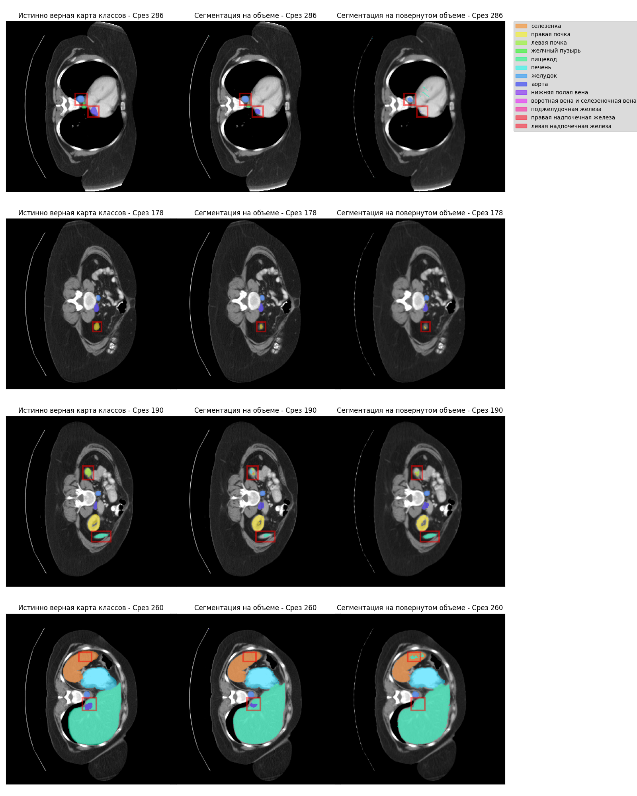

# Отчет по эксперименту оценки положения 3D КТ-снимка в пространстве на итоговый результат сегментации

## Введение

В данном эксперименте рассматривается гипотеза о том, что модели машинного обучения, используемые для сегментации медицинских изображений, могут переобучаться под конкретное положение объекта в пространстве. Это означает, что модели могут демонстрировать высокую точность сегментации на данных с фиксированной ориентацией объекта, но значительно терять в качестве при изменении его положения.

Для проверки гипотезы были проведены эксперименты по моделированию объектов в различных ориентациях в пространстве и сравнение качества сегментации между экспериментами. Для сегментации использовалась предварительно обученная модель $\text{Unetr}$, которая была выбрана благодаря доступной официальной реализации и предобученным весам. Модель была обучена на наборе данных $\text{BTCV}$, содержащем КТ-снимки и сегментации органов брюшной полости. Все изображения в наборе данных были зафиксированы в одном положении, что означает одинаковую ориентацию всех данных. Для экспериментов применялась только валидационная выборка из этого набора данных. В процессе обучения к этим объемам случайным образом применялись следующие искажения:

- зеркальное отражение по одной из осей,
- поворот на 90 градусов относительно одной из трех основных осей,
- изменение интенсивности пикселей изображения.

Важно отметить, что в оригинальной статье авторы дополнительно использовали закрытый набор данных, что привело к более высоким результатам сегментации по сравнению с теми, которые можно получить с использованием только общедоступных весов.

## Моделирование различных положений объекта в пространстве

Для моделирования различных ориентаций объекта в трёхмерном пространстве была проведена серия из 3 экспериментов, включающих повороты изображений на случайные углы вокруг произвольных осей, проходящих через центр изображения. Эксперименты различаются диапазоном углов поворота:

| Эксперимент | Диапазон углов поворота | Число поворотов  | Описание                |
|-------------|-------------------------|------------------|-------------------------|
| 1           | $(0^\circ, 1^\circ]$    | 51               | Очень малые повороты    |
| 2           | $(1^\circ, 5^\circ]$    | 101              | Малые повороты          |
| 3           | $(5^\circ, 20^\circ]$   | 201              | Значимые повороты       |

Для каждого эксперимента было создано свое количество поворотов. Их количество отличается, так как больший диапазон угла поворота требует большего количества поворотов для лучшего покрытия всех возможных ориентаций. Каждый поворот описывается вектором вращения $\vec{v} = \theta \cdot \vec{e}$, где $\theta$ — угол поворота, а $\vec{e}$ — единичный вектор направления оси вращения. Вектор $\vec{e}$ генерировался путем нормализации случайного трёхмерного вектора, равномерно распределённого в диапазоне $[-1, 1]^3$. Угол $\theta$ выбирался из равномерного распределения на заданном для каждого эксперимента диапазоне.

### Реализация

Повороты изображений моделировались с помощью аффинных преобразований, реализованных с использованием объекта `Affine` из библиотеки `Monai`. Для поворота изображения использовалась интерполяция `bilinear`, а для карты классов — `nearest`. Аффинные преобразования основывались на матрицах, полученных с помощью функции `Rotation.from_rotvec` из библиотеки `scipy` и сформированных на основе векторов вращения из экспериментов.

Особое внимание следует уделить этапу применения операции поворота в процессе обработки данных. В одной из стадий обработки данных авторы выполняют ресэмплинг, чтобы привести разрешение изображений к масштабу: расстояние между пикселями по осям X и Y устанавливается на 1.5 мм, а по оси Z — на 2 мм. Поворот необходимо выполнять только после этого этапа, поскольку его применение до ресэмплинга может привести к несоответствию разрешения изображения, что не соответствует условиям, на которых обучалась нейронная сеть. Также при повороте изображения возможна потеря информации из-за выхода за границы, поэтому к каждому объему добавлялась рамка размера, предотвращающего любые возможные потери такого рода (размер сохранялся между экспериментами). В связи со всем с этим операции добавления рамки и поворота были включены в процесс обработки данных сразу после шага ресэмплинга.

Для оценки степени потери информации при поворотах были проведены дополнительные эксперименты. В этих экспериментах к изображениям и картам классов применялись те же аффинные преобразования, что и в основном эксперименте, после чего выполнялись обратные преобразования. Затем вычислялась ошибка между исходными и восстановленными изображениями. В качестве метрики для измерения расхождения между исходным и восстановленным изображением использовалась MAPE, считавшаяся только по ненулевым вокселям изображения, а для оценки совпадения карт классов применялась метрика Dice. Обратные преобразования выполнялись с использованием функции `Affine.inverse` из библиотеки `Monai`.

### Оценка влияния размера рамки на качество сегментации

В ходе работы было выявлено, что размер добавляемой рамки, которая используется для предотвращения потери информации при повороте изображений, может влиять на качество сегментации. Для исследований была взята модель $\text{Unetr}$, основанная на архитектуре трансформера. Она выполняет сегментацию изображения с использованием скользящего окна размером $96 \times 96 \times 96$ с 50%-ным перекрытием по площади, где каждая непересекающаяся часть размером $16 \times 16 \times 16$ рассматривается как токен, подающийся в трансформер.

Основная гипотеза состояла в том, что некратные значения размера рамки $16$ могут негативно сказываться на качестве сегментации. Для проверки данной гипотезы были проведены эксперименты, в которых сегментация выполнялась для неповернутых изображений с различными размерами рамок. Рассматривались два набора размеров рамок: $\{0, 4, 8, 12, 16, 20\}$ и $\{96, 100, 104, 108, 112, 116\}$. Это позволило проанализировать не только влияние рамки, но и оценить возможное влияние скользящего окна на результаты сегментации.

Результаты экспериментов представлены в таблице, где жирным шрифтом выделены показатели для рамок, размеры которых кратны $16$.

| Размер рамки | Средний Dice | Средний IoU | Средний Precision | Средний Recall |
| ------------ | ------------ | ----------- | ----------------- | -------------- |
| **0** | **0.774** | **0.651** | **0.818** | **0.918** |
| 4 | 0.706 | 0.562 | 0.670 | 0.912 |
| 8 | 0.708 | 0.566 | 0.692 | 0.911 |
| 12 | 0.713 | 0.574 | 0.688 | 0.909 |
| **16** | **0.799** | **0.680** | **0.868** | **0.916** |
| 20 | 0.705 | 0.561 | 0.656 | 0.909 |
| **96** | **0.768** | **0.648** | **0.846** | **0.906** |
| 100 | 0.707 | 0.564 | 0.669 | 0.907 |
| 104 | 0.711 | 0.571 | 0.701 | 0.902 |
| 108 | 0.716 | 0.576 | 0.702 | 0.897 |
| **112** | **0.772** | **0.647** | **0.843** | **0.902** |
| 116 | 0.699 | 0.554 | 0.643 | 0.902 |

Анализ метрик Dice, IoU и Precision демонстрирует, что использование рамок с размерами, не кратными $16$, действительно приводит к снижению качества сегментации. При этом, параметры скользящего окна не оказали значимого влияния на результат сегментации. Исходя из этих наблюдений, в дальнейших экспериментах было принято решение использовать только размеры рамки, кратные $16$, чтобы гарантировать стабильное качество сегментации.

### Результаты экспериментов по оценке потери информации при поворотах

Результаты экспериментов по оценке потери информации при поворотах представлены в следующей таблице:

| Эксперимент | Диапазон углов | Число поворотов | Среднее MAPE для изображений | Средний Dice для карт классов |
|---|-------------------------------|-----|------------------------------|-------------------------------|
| 1 | $(0^\circ, 1^\circ]$          | 51  | 0.0127                       | 0.999                         |
| 2 | $(1^\circ, 5^\circ]$          | 101 | 0.0147                       | 0.996                         |
| 3 | $(5^\circ, 20^\circ]$         | 201 | 0.0151                       | 0.986                         |

Как видно из таблицы, даже при небольших углах поворота (0°–1°) наблюдается незначительная потеря информации. С увеличением угла поворота потеря информации возрастает, что отражается в увеличении MAPE для изображений и уменьшении Dice для карт классов. Тем не менее, даже при значительных поворотах (5°–20°) потеря информации остается относительно небольшой, что свидетельствует о корректности применяемого метода поворота изображений.

## Оценка влияния положения объекта в пространстве на результат сегментации

Оценка влияния положения объекта в пространстве на результат сегментации проводилась на основе данных, полученных из экспериментов 1–3. Модель сегментировала повернутые изображения из каждого эксперимента, и для каждого набора данных был рассчитан средние Dice, IoU, Precision и Recall между повернутыми истинными картами классов и сегментацией на повернутых изображениях. Все метрики считались в режиме макро, то есть усреднялись среди всех классов, исключая фон. Также были метрики были подсчитаны на оригинальных, неповернутых изображениях как с добавлением рамки, так и без нее. Все значения указаны в сравнительной таблице:

| Описание | Диапазон углов | Средний Dice | Средний IoU | Средний Precision | Средний Recall |
| -------- | -------------- | ------------ | ----------- | ----------------- | -------------- |
| Оригинальные изображения          | -                     | 0.774 | 0.651 | 0.818 | 0.918 |
| Оригинальные изображения с рамкой | -                     | 0.799 | 0.680 | 0.868 | 0.916 |
| Эксперимент 1                     | $[0^\circ, 1^\circ]$  | 0.774 | 0.647 | 0.802 | 0.910 |
| Эксперимент 2                     | $[1^\circ, 5^\circ]$  | 0.735 | 0.598 | 0.715 | 0.907 |
| Эксперимент 3                     | $[5^\circ, 20^\circ]$ | 0.690 | 0.549 | 0.684 | 0.886 |

Также были созданы изображения для визуального сравнения сегментации модели на повернутых и оригинальных снимках. Эти изображения отображают 4 среза, где наблюдаются наибольшие различия между сегментацией на оригинальных и повернутых данных, обведенные красной рамкой. Для анализа использовались повернутые изображения, соответствующие медианному значению Dice в каждом эксперименте. Пример такого изображения для второго эксперимента приведен ниже:

Сравнение сегментации для эксперимента 1 с очень малыми поворотами:

Сравнение сегментации для эксперимента 2 с малыми поворотами:

Сравнение сегментации для эксперимента 3 с значительными поворотами:

## Выводы

Результаты экспериментов подтверждают влияние угла поворота 3D КТ-снимков на качество сегментации, что соответствует выдвинутой гипотезе. Все четыре метрики демонстрируют последовательное снижение по мере увеличения угла поворота. Наиболее заметная деградация наблюдается в метриках IoU и Precision, которые снижаются с $0.680$ до $0.549$ и с $0.868$ до $0.684$ соответственно. Визуальный анализ сегментаций в эксперименте 3 также подтверждает ухудшение Precision, тогда как метрика Recall остаётся высокой и стабильной на всех изображениях. Это свидетельствует о том, что при увеличении угла поворота относительно произвольной оси, проходящей через центр изображения, модель генерирует больше ложно положительных сегментаций.
<!-- Показатель Dice в среднем снижается с 0.756 при незначительных углах поворота $[0^\circ, 1^\circ]$ относительной произвольной прямой, проходящей через центр изображения, до 0.698 при более существенных углах $[5^\circ, 20^\circ]$. Тем не менее, визуальный анализ демонстрирует, что степень этого влияния не велика. Следовательно, можно сделать вывод, что модели сегментации медицинских изображений могут проявлять некоторое переобучение относительно конкретного пространственного расположения сканируемого объекта. -->
